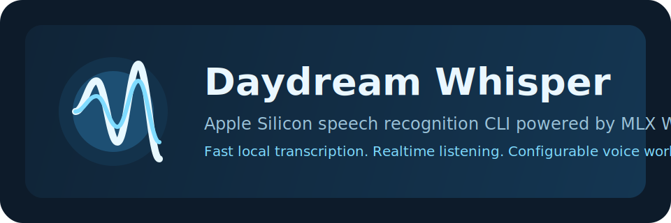

# Daydream Whisper



English | [中文](#中文)

Daydream Whisper is a speech-first local transcription toolkit for Apple Silicon. It keeps Whisper on the critical ASR path, adds realtime listening and OpenAI-style HTTP serving, and can optionally pass finished transcripts to a separate local text or multimodal model for cleanup, summaries, or note formatting.

The executable is `dwhisper`. The project name stays `Daydream Whisper`.

## Quick Start

### 1. Install

```bash
curl -fsSL https://raw.githubusercontent.com/Starry331/Daydream-Whisper/main/install.sh -o /tmp/dwhisper-install.sh
zsh /tmp/dwhisper-install.sh
```

The GitHub repo lives at `https://github.com/Starry331/Daydream-Whisper`. The project name and executable stay `Daydream Whisper` and `dwhisper`.

### 2. Pull a starter model

```bash
dwhisper pull whisper:base
```

### 3. Transcribe a file

```bash
dwhisper run ./meeting.wav
```

### 4. Realtime microphone listening

```bash
dwhisper listen --model whisper:base
```

### 5. Serve a local API for other apps

```bash
dwhisper serve --model whisper:base --host 127.0.0.1 --port 11500
```

### 6. Optional transcript cleanup with a local text or multimodal model

The shortest common form is:

```bash
dwhisper run ./meeting.wav --post-model glm-4.1v
```

`--post-model` implies `--postprocess` and defaults the post-process endpoint to `http://127.0.0.1:11435/v1`.

If you want a different rewrite mode:

```bash
dwhisper run ./meeting.wav --post-model glm-4.1v --post-mode summary
```

Examples of usable post-process model names include `glm-4.1v`, `llava-next`, `local-mm-model`, or any other local model name exposed through an OpenAI-compatible endpoint. Daydream Whisper does not hardcode a specific model family.

## What It Does

- Runs local Whisper models through MLX on Apple Silicon
- Transcribes files to `text`, `json`, `srt`, `vtt`, or `verbose_json`
- Listens to the microphone in realtime
- Supports profiles, vocabulary rules, and transcript cleanup rules
- Exposes a local speech API for dictation, note-taking, and voice apps
- Optionally sends finished transcript text to a separate local text or multimodal model
- Avoids colliding with the original Daydream CLI by using `dwhisper`, not `daydream`

## Why The Command Is `dwhisper`

- `daydream run`, `daydream serve`, and `daydream cp` belong to the original Daydream CLI
- Daydream Whisper must stay isolated so it does not break or overwrite the original tool
- The installer creates only `dwhisper`
- The uninstaller removes only Daydream Whisper files it can positively identify

## Requirements

- Apple Silicon Mac
- Python `3.14+`
- `ffmpeg` for MP3, M4A, and other compressed formats
- `portaudio` for microphone capture via `sounddevice`

## Install And Uninstall

### Interactive install

```bash
curl -fsSL https://raw.githubusercontent.com/Starry331/Daydream-Whisper/main/install.sh -o /tmp/dwhisper-install.sh
zsh /tmp/dwhisper-install.sh
```

What the installer does:

- clones or updates `~/Daydream-Whisper`
- recreates an isolated `~/Daydream-Whisper/.venv`
- installs the package inside that isolated environment
- creates `~/.local/bin/dwhisper`
- pulls `whisper:base` as a starter model

What the installer does not do:

- it does not install `daydream`
- it does not overwrite an existing Daydream CLI environment
- it does not remove your existing Python or Homebrew setup

### Manual install

```bash
git clone https://github.com/Starry331/Daydream-Whisper.git
cd Daydream-Whisper
python3.14 -m venv .venv
source .venv/bin/activate
pip install -U pip setuptools wheel
pip install -e .
```

### Run from a repo checkout

```bash
./dwhisper --help
python3 -m dwhisper --help
```

### Uninstall

```bash
curl -fsSL https://raw.githubusercontent.com/Starry331/Daydream-Whisper/main/uninstall.sh -o /tmp/dwhisper-uninstall.sh
zsh /tmp/dwhisper-uninstall.sh
```

The uninstaller is intentionally conservative:

- it removes only the Daydream Whisper checkout
- it removes only a `dwhisper` launcher that points to Daydream Whisper
- it removes only `~/.dwhisper` or another clearly dedicated Daydream Whisper home
- it does not remove Homebrew packages, shared Hugging Face cache, system Python, or unrelated virtual environments

## Common Commands

| Command | Purpose | Notes |
| --- | --- | --- |
| `dwhisper pull <model>` | Download a model or register a local reference | Supports aliases, HF repo IDs, and local paths |
| `dwhisper list` | Show downloaded and discovered models | Includes registered local models |
| `dwhisper rm <model>` | Remove a cached model | Add `--force` to skip prompt |
| `dwhisper show <model>` | Print local model metadata | Useful for debugging model directories |
| `dwhisper models` | List built-in aliases | Shows local vs Hugging Face source |
| `dwhisper profiles` | List reusable profiles | Reads `~/.dwhisper/profiles.yaml` and `~/.dwhisper/profiles/*.yaml` |
| `dwhisper run <audio>` | Transcribe a file | Alias of `dwhisper transcribe` |
| `dwhisper listen` | Realtime microphone transcription | Supports VAD and push-to-talk |
| `dwhisper devices` | List input devices | Helps choose `--device` |
| `dwhisper serve` | Start local speech API server | Designed for external voice apps |
| `dwhisper doctor` | Check local environment readiness | Verifies Python, MLX, PortAudio, cache, and post-process defaults |

### Environment Check

Run `dwhisper doctor` after install or when microphone capture, serving, or local post-processing behaves unexpectedly.

It checks:

- Python version
- `mlx-whisper` and MLX device availability
- `sounddevice` / PortAudio
- visible input devices
- writable `~/.dwhisper` home
- default serve port availability
- free disk space and cached Whisper models
- local post-process defaults

Use `dwhisper doctor --strict` if warnings should also return a non-zero exit code.

## Simple Configuration

Persistent config lives in `~/.dwhisper/config.yaml`.

The common files are:

- `~/.dwhisper/config.yaml`
- `~/.dwhisper/profiles.yaml`
- `~/.dwhisper/profiles/`
- `~/.dwhisper/corrections.yaml`
- `~/.dwhisper/vocabulary.yaml`
- `~/.dwhisper/models/`

Configuration precedence is:

1. CLI flags
2. Environment variables
3. `~/.dwhisper/config.yaml`
4. Built-in defaults

### Minimal config example

```yaml
model: whisper:large-v3-turbo

transcribe:
  language: null
  task: transcribe
  output_format: text
  word_timestamps: false

postprocess:
  enabled: false
  model: null
  base_url: null
  api_key: dwhisper-local
  mode: clean
  timeout: 30

audio:
  sample_rate: 16000
  device: null

listen:
  chunk_duration: 3.0
  overlap_duration: 0.5
  silence_threshold: 1.0
  vad_sensitivity: 0.6
  push_to_talk: false

serve:
  host: 127.0.0.1
  port: 11500
  max_concurrency: 2
  request_timeout: 120
  max_request_bytes: 52428800
  preload: false
  allow_origin: "*"
```

### Common environment variables

Daydream Whisper prefers `DWHISPER_*` variables and also accepts legacy `DAYDREAM_*` names for compatibility.

Useful examples:

- `DWHISPER_MODEL`
- `DWHISPER_LANGUAGE`
- `DWHISPER_PROFILE`
- `DWHISPER_OUTPUT_FORMAT`
- `DWHISPER_POSTPROCESS`
- `DWHISPER_POSTPROCESS_MODEL`
- `DWHISPER_POSTPROCESS_BASE_URL`
- `DWHISPER_POSTPROCESS_MODE`
- `DWHISPER_CORRECTIONS_FILE`
- `DWHISPER_VOCABULARY_FILE`
- `DWHISPER_AUDIO_DEVICE`
- `DWHISPER_SAMPLE_RATE`
- `DWHISPER_CHUNK_DURATION`
- `DWHISPER_OVERLAP_DURATION`
- `DWHISPER_SILENCE_THRESHOLD`
- `DWHISPER_VAD_SENSITIVITY`
- `DWHISPER_PUSH_TO_TALK`
- `DWHISPER_HOST`
- `DWHISPER_PORT`
- `DWHISPER_SERVE_MAX_CONCURRENCY`
- `DWHISPER_SERVE_REQUEST_TIMEOUT`
- `DWHISPER_SERVE_MAX_REQUEST_BYTES`
- `DWHISPER_SERVE_PRELOAD`
- `DWHISPER_SERVE_ALLOW_ORIGIN`

## API Route Map

When `dwhisper serve` is running on the default port, the local base URL is:

```text
http://127.0.0.1:11500
```

### Route overview

| Route | Method | Purpose | Compatibility |
| --- | --- | --- | --- |
| `/health` | `GET` | Basic process status | Daydream Whisper local health route |
| `/ready` | `GET` | Readiness and loaded model state | Daydream Whisper local readiness route |
| `/metrics` | `GET` | Prometheus-style metrics | Daydream Whisper local metrics route |
| `/v1/models` | `GET` | List available models | OpenAI-style model list |
| `/v1/audio/transcriptions` | `POST` | Speech-to-text transcription | OpenAI-style audio transcription route |
| `/v1/audio/translations` | `POST` | Speech translation | OpenAI-style audio translation route |
| `/v1/text/postprocess` | `POST` | Text-only cleanup, summary, or formatting | Daydream Whisper post-process route |
| `/v1/text/clean` | `POST` | Text cleanup | Pinned `mode=clean` shortcut |
| `/v1/text/summary` | `POST` | Transcript summarization | Pinned `mode=summary` shortcut |
| `/v1/text/meeting-notes` | `POST` | Meeting notes formatting | Pinned `mode=meeting-notes` shortcut |
| `/v1/text/speakers` | `POST` | Speaker formatting | Pinned `mode=speaker-format` shortcut |
| `/v1/postprocess` | `POST` | Alias of the text post-process route | Short local alias |

### Health endpoints

```bash
curl http://127.0.0.1:11500/health
curl http://127.0.0.1:11500/ready
curl http://127.0.0.1:11500/metrics
curl http://127.0.0.1:11500/v1/models
```

### File transcription over API

Multipart request:

```bash
curl http://127.0.0.1:11500/v1/audio/transcriptions \
  -F file=@./meeting.wav \
  -F model=whisper:base \
  -F language=zh \
  -F response_format=verbose_json
```

JSON request with a local path:

```bash
curl http://127.0.0.1:11500/v1/audio/transcriptions \
  -H "Content-Type: application/json" \
  -d '{
    "audio_path": "/absolute/path/to/meeting.wav",
    "model": "whisper:base",
    "response_format": "verbose_json"
  }'
```

### Translation over API

```bash
curl http://127.0.0.1:11500/v1/audio/translations \
  -H "Content-Type: application/json" \
  -d '{
    "audio_path": "/absolute/path/to/meeting.wav",
    "model": "whisper:base",
    "response_format": "text"
  }'
```

### Text post-process route

Use this when another app already has text and only wants cleanup, summary, meeting notes, or speaker formatting.

```bash
curl http://127.0.0.1:11500/v1/text/postprocess \
  -H "Content-Type: application/json" \
  -d '{
    "text": "helo world this is messy",
    "model": "glm-4.1v",
    "base_url": "http://127.0.0.1:11435/v1",
    "mode": "clean",
    "response_format": "json"
  }'
```

You can also call:

```text
POST /v1/postprocess
```

It is an alias for the same text-only route.

Mode-pinned shortcuts are also available:

```text
POST /v1/text/clean
POST /v1/text/summary
POST /v1/text/meeting-notes
POST /v1/text/speakers
```

### Streaming SSE for `/v1/text/*`

Any `/v1/text/*` route can stream incremental deltas over SSE by adding `"stream": true`.

```bash
curl -N http://127.0.0.1:11500/v1/text/summary \
  -H "Content-Type: application/json" \
  -d '{
    "text": "helo world this is messy",
    "model": "glm-4.1v",
    "base_url": "http://127.0.0.1:11435/v1",
    "stream": true
  }'
```

Response details:

- content type is `text/event-stream`
- each SSE frame is `data: { ... }`
- the stream ends with `data: [DONE]`
- the last JSON frame before `[DONE]` includes `done: true`, the aggregate `text`, the original `raw_text`, and `postprocess` metadata so clients can reconstruct the final result from that frame alone

### App integration examples

`dwhisper` serves by default on `http://127.0.0.1:11500` so it does not collide with the original Daydream CLI on port `11434`.

Common values to fill into another app:

```text
OpenAI-compatible Base URL: http://127.0.0.1:11500/v1
```

Full routes:

- transcription: `POST http://127.0.0.1:11500/v1/audio/transcriptions`
- translation: `POST http://127.0.0.1:11500/v1/audio/translations`
- text cleanup: `POST http://127.0.0.1:11500/v1/text/clean`
- summary: `POST http://127.0.0.1:11500/v1/text/summary`
- meeting notes: `POST http://127.0.0.1:11500/v1/text/meeting-notes`
- speaker formatting: `POST http://127.0.0.1:11500/v1/text/speakers`
- generic post-process: `POST http://127.0.0.1:11500/v1/text/postprocess`
- SSE streaming: add `"stream": true` to any `/v1/text/*` request body
- health and capability checks: `GET http://127.0.0.1:11500/health`, `/ready`, `/metrics`, `/v1/models`

API key:

- default is `dwhisper-local`
- this is only a placeholder and local serving does not enforce auth
- if a third-party app requires an API key field, fill in `dwhisper-local`

Examples:

- [闪电说](https://shandianshuo.cn) or another OpenAI-compatible third-party app will usually want `http://127.0.0.1:11500/v1` as the Base URL
- an app that sends speech should call `POST /v1/audio/transcriptions`
- an app that already has plain text and wants rewriting should call `POST /v1/text/postprocess`
- an app that wants streaming summaries should call `POST /v1/text/summary` with `"stream": true`

If the port is already in use, change it with `dwhisper serve --port <N>` or `DWHISPER_PORT`.

Minimal reference:

```text
Server root: http://127.0.0.1:11500
Base URL: http://127.0.0.1:11500/v1
API Key: dwhisper-local
Speech route: POST /v1/audio/transcriptions
Text route: POST /v1/text/postprocess
Streaming summary route: POST /v1/text/summary
Meeting notes route: POST /v1/text/meeting-notes
```

### Audio transcription with optional post-processing

```bash
curl http://127.0.0.1:11500/v1/audio/transcriptions \
  -H "Content-Type: application/json" \
  -d '{
    "audio_path": "/absolute/path/to/meeting.wav",
    "model": "whisper:base",
    "postprocess": true,
    "postprocess_model": "glm-4.1v",
    "postprocess_base_url": "http://127.0.0.1:11435/v1",
    "postprocess_mode": "clean"
  }'
```

### Common request fields

For `/v1/audio/transcriptions` and `/v1/audio/translations`:

- `file`
- `audio_path`
- `model`
- `language`
- `task`
- `response_format`
- `word_timestamps`
- `prompt` or `initial_prompt`
- `temperature`
- `beam_size`
- `best_of`
- `hotwords`
- `vocabulary`
- `correction`
- `profile`
- `postprocess`
- `postprocess_model`
- `postprocess_base_url`
- `postprocess_api_key`
- `postprocess_mode`
- `postprocess_prompt`
- `postprocess_timeout`

For `/v1/text/postprocess` and `/v1/postprocess`:

- `text`
- `language`
- `response_format`
- `model`
- `base_url`
- `api_key`
- `mode`
- `prompt`
- `timeout`
- `backend`
- `max_tokens`
- `stream`

## Advanced Usage

### 1. Profiles

Use profiles when you want stable presets for meetings, dictation, subtitles, interviews, or domain terms.

Both storage styles are supported:

- single file: `~/.dwhisper/profiles.yaml`
- one file per profile: `~/.dwhisper/profiles/meeting.yaml`

Example `~/.dwhisper/profiles.yaml`:

```yaml
profiles:
  meeting-zh:
    model: whisper:large-v3-turbo
    output_format: text
    transcribe:
      language: zh
      hotwords:
        - Daydream
        - MLX
      vocabulary:
        helo: hello
      postprocess: true
      postprocess_model: glm-4.1v
      postprocess_base_url: http://127.0.0.1:11435/v1
      postprocess_mode: clean
    listen:
      chunk_duration: 2.8
      overlap_duration: 0.4
      silence_threshold: 0.9
      vad_sensitivity: 0.65
```

Use it like this:

```bash
dwhisper run ./meeting.wav --profile meeting-zh
dwhisper listen --profile meeting-zh
```

Equivalent per-profile file example `~/.dwhisper/profiles/meeting.yaml`:

```yaml
model: whisper:large-v3-turbo
output_format: text
transcribe:
  language: zh
  postprocess: true
  postprocess_model: glm-4.1v
  postprocess_mode: meeting-notes
listen:
  chunk_duration: 2.8
```

### 2. Corrections and vocabulary

Use corrections when raw ASR is close but not polished enough.

Example `~/.dwhisper/corrections.yaml`:

```yaml
capitalize_sentences: true
trim_repeated_whitespace: true
replacements:
  - from: day dream
    to: Daydream
  - from: mlx whisper
    to: MLX Whisper
```

Example `~/.dwhisper/vocabulary.yaml`:

```yaml
helo: hello
smollm: SmolLM
mlx: MLX
```

CLI usage:

```bash
dwhisper run ./demo.wav \
  --hotword Daydream \
  --vocabulary-entry helo=hello \
  --corrections-file ~/.dwhisper/corrections.yaml \
  --vocabulary-file ~/.dwhisper/vocabulary.yaml
```

### 3. Optional post-processing with any local text or multimodal model

Important boundary:

- Whisper remains the ASR engine
- the optional second stage is only for transcript text after recognition
- that second stage can point to any local model service that exposes an OpenAI-compatible API

The simplest form:

```bash
dwhisper run ./meeting.wav --post-model glm-4.1v
```

If your model service runs somewhere else:

```bash
dwhisper run ./meeting.wav \
  --post-model local-mm-model \
  --post-url http://127.0.0.1:8081/v1 \
  --post-mode meeting-notes
```

Supported post-process modes:

- `clean`
- `summary`
- `meeting-notes`
- `speaker-format`

If you do not explicitly set `--post-max-tokens`, dwhisper uses mode-aware defaults:

- `clean`: `256`
- `summary`: `768`
- `speaker-format`: `1024`
- `meeting-notes`: `2048`

The same pattern also works in listen mode:

```bash
dwhisper listen --profile meeting-zh --post-model glm-4.1v
```

And as server defaults:

```bash
dwhisper serve \
  --model whisper:base \
  --post-model glm-4.1v \
  --post-url http://127.0.0.1:11435/v1
```

### 4. Realtime listening tuning

The main knobs are:

- `chunk_duration`: maximum speech buffered before forced flush
- `overlap_duration`: overlap between chunks to reduce word-boundary loss
- `silence_threshold`: silence needed to finalize a chunk
- `vad_sensitivity`: higher means speech detection triggers more easily
- `push_to_talk`: bypass VAD and gate capture with the keyboard

Common starting points:

- dictation: `chunk_duration=2.5`, `silence_threshold=0.8`
- meetings: `chunk_duration=3.0`, `silence_threshold=1.0`
- noisy rooms: lower `vad_sensitivity`, increase `silence_threshold`

### 5. Local model resolution

Daydream Whisper accepts:

- built-in aliases like `whisper:base`
- full Hugging Face repo IDs like `mlx-community/whisper-base-mlx`
- `hf.co/...` references
- local Whisper MLX model directories
- local bundle roots that embed a Whisper checkpoint in a subdirectory

This means you can point `dwhisper` at either a plain Whisper directory or a larger local app bundle that contains a speech submodel.

### 6. End-to-end example: pull from Hugging Face, use locally, then connect 闪电说

This is a practical start-to-finish flow for a Hugging Face Whisper checkpoint.

1. Pull a Whisper model from Hugging Face.

```bash
dwhisper pull mlx-community/whisper-large-v3-turbo
```

The built-in shortcut for the same checkpoint is:

```bash
dwhisper pull whisper:large-v3-turbo
```

If Hugging Face rate-limits you, export `HF_TOKEN` first and retry.

2. Confirm the model is available locally.

```bash
dwhisper show whisper:large-v3-turbo
dwhisper list
```

3. Make it the local default in `~/.dwhisper/config.yaml`.

```yaml
model: whisper:large-v3-turbo

serve:
  host: 127.0.0.1
  port: 11500
  preload: true
```

For built-in checkpoints, the built-in alias and the full Hugging Face repo ID are interchangeable.

4. Use it locally from the CLI.

```bash
dwhisper transcribe ./meeting.wav
dwhisper listen
```

If you do not want to set a global default, keep your config unchanged and pass the model explicitly:

```bash
dwhisper transcribe ./meeting.wav --model whisper:large-v3-turbo
```

5. Start the local API.

```bash
dwhisper serve --model whisper:large-v3-turbo --preload
```

Quick verification:

```bash
curl http://127.0.0.1:11500/health
curl http://127.0.0.1:11500/v1/models
```

6. Connect [闪电说](https://shandianshuo.cn) or another OpenAI-compatible app.

Use these values:

```text
Base URL: http://127.0.0.1:11500/v1
API Key: dwhisper-local
Model: whisper:large-v3-turbo
Speech-to-text route: /audio/transcriptions
Translation route: /audio/translations
Text cleanup route: /text/clean
Summary route: /text/summary
Meeting notes route: /text/meeting-notes
```

If the app only asks for Base URL and API Key, that is usually enough and the server-side default model will be used. If you changed the port, update the Base URL to match.

### 7. Qwen3 example backend: Qwen3-ASR-1.7B-4bit + Qwen3-4B-4bit

If you specifically want a Qwen-style backend example, the current support boundary matters:

- `dwhisper` still uses Whisper as the first-stage ASR engine on `transcribe`, `listen`, and `/v1/audio/*`
- `Qwen3-4B-4bit` fits naturally as the second-stage post-process backend
- `Qwen3-ASR-1.7B-4bit` is not a drop-in replacement for the built-in Whisper ASR path today

Supported `dwhisper` setup:

1. Keep Whisper for speech recognition.
2. Use `Qwen3-4B-4bit` as the post-process model.
3. Expose `dwhisper serve` to apps like 闪电说.

Example config with an in-process MLX backend:

```yaml
model: whisper:large-v3-turbo

postprocess:
  enabled: true
  model: Qwen/Qwen3-4B-4bit
  backend: mlx
  mode: clean
  timeout: 60

serve:
  host: 127.0.0.1
  port: 11500
  preload: true
```

You will also need `mlx-lm` for the local MLX text backend:

```bash
pip install mlx-lm
```

Replace `Qwen/Qwen3-4B-4bit` with the exact MLX model ID or local path you actually installed.

Equivalent one-shot serve command:

```bash
dwhisper serve \
  --model whisper:large-v3-turbo \
  --preload \
  --post-backend mlx \
  --post-model Qwen/Qwen3-4B-4bit \
  --post-mode clean
```

If you already expose `Qwen3-4B-4bit` through an OpenAI-compatible HTTP service, use `postprocess.backend: http` plus `postprocess.base_url`, or the CLI equivalent:

```bash
dwhisper serve \
  --model whisper:large-v3-turbo \
  --preload \
  --post-backend http \
  --post-model Qwen3-4B-4bit \
  --post-url http://127.0.0.1:11435/v1 \
  --post-mode clean
```

What this gives you:

- Whisper handles speech recognition
- `Qwen3-4B-4bit` can clean transcript text with `/v1/text/clean`
- it can summarize transcripts with `/v1/text/summary`
- it can turn transcripts into notes with `/v1/text/meeting-notes`
- it can normalize speaker labels with `/v1/text/speakers`
- long text routes can stream over SSE with `"stream": true`

If you already run an external stack where `Qwen3-ASR-1.7B-4bit` performs speech recognition and `Qwen3-4B-4bit` performs rewrite/summary, treat that as a separate OpenAI-compatible service. `dwhisper` itself does not currently swap its `/v1/audio/*` speech backend from Whisper to Qwen3-ASR.

For apps like [闪电说](https://shandianshuo.cn), the practical `dwhisper` values are still:

```text
Base URL: http://127.0.0.1:11500/v1
API Key: dwhisper-local
Model: whisper:large-v3-turbo
```

That means:

- speech input still goes through Whisper
- text cleanup / summary / meeting notes can go through `Qwen3-4B-4bit`

### 8. Production-oriented serving

Useful serving flags:

- `--preload`
- `--max-concurrency`
- `--request-timeout`
- `--max-request-bytes`
- `--allow-origin`
- `--post-model`
- `--post-url`

Example:

```bash
dwhisper serve \
  --model whisper:base \
  --preload \
  --max-concurrency 4 \
  --request-timeout 180 \
  --max-request-bytes 104857600 \
  --allow-origin http://localhost:3000 \
  --post-model glm-4.1v
```

The server also provides:

- persistent Whisper workers
- readiness and metrics endpoints
- `X-Request-ID`
- processing-time headers
- bounded concurrency to reduce runtime stampedes

## FAQ

### Does this conflict with the original Daydream CLI?

No. Daydream Whisper uses `dwhisper`. It does not install or expose `daydream`.

### Can I use a generic multimodal model directly as the ASR model?

Not in the current architecture. Whisper is still the speech recognition engine. A text or multimodal model can be used after Whisper as an optional cleanup or formatting layer.

### Does post-processing require a specific model family?

No. Any local text or multimodal model served through an OpenAI-compatible endpoint can be used.

### Which endpoint should another app call?

- For speech files or file paths: `POST /v1/audio/transcriptions`
- For speech translation: `POST /v1/audio/translations`
- For generic text-only cleanup or summarization: `POST /v1/text/postprocess`
- For mode-pinned text routes: `POST /v1/text/clean`, `/v1/text/summary`, `/v1/text/meeting-notes`, or `/v1/text/speakers`
- For streaming text post-process responses: add `"stream": true` to any `/v1/text/*` request
- For health checks: `GET /health` or `GET /ready`
- For monitoring: `GET /metrics`

### Where should I put my default config?

Start with `~/.dwhisper/config.yaml`. Put reusable presets in `~/.dwhisper/profiles.yaml` or `~/.dwhisper/profiles/*.yaml`.

### What if microphone capture is unstable?

Try these first:

- lower `vad_sensitivity`
- raise `silence_threshold`
- switch devices with `dwhisper devices` and `--device`
- use `--push-to-talk` for deterministic capture
- run `dwhisper doctor` to verify PortAudio, permissions, and visible input devices

### What if a local post-process model is slow?

Keep Whisper as the ASR stage and lower the second-stage load:

- use `--post-mode clean` instead of `summary`
- increase `--post-timeout` only if needed
- point `--post-url` at a faster local model service

### What if I only want text cleanup and not speech recognition?

Call `POST /v1/text/postprocess` or `POST /v1/postprocess` directly.

## 中文

Daydream Whisper 是一个面向 Apple Silicon 的本地语音识别与听写工具。它把 Whisper 固定在语音识别主链路上，再补充实时监听、OpenAI 风格 HTTP 服务，以及可选的“转录完成后文本后处理”能力。这个后处理层可以接本地文本模型，也可以接本地多模态模型，但它是第二阶段，不会替代 Whisper 主识别链路。

项目名保持 `Daydream Whisper`，真正的终端命令统一是 `dwhisper`。

## 快速上手

### 1. 安装

```bash
curl -fsSL https://raw.githubusercontent.com/Starry331/Daydream-Whisper/main/install.sh -o /tmp/dwhisper-install.sh
zsh /tmp/dwhisper-install.sh
```

当前 GitHub 仓库地址是 `https://github.com/Starry331/Daydream-Whisper`。项目名和命令名仍然分别保持为 `Daydream Whisper` 与 `dwhisper`。

### 2. 下载一个起步模型

```bash
dwhisper pull whisper:base
```

### 3. 转录音频文件

```bash
dwhisper run ./meeting.wav
```

### 4. 实时麦克风听写

```bash
dwhisper listen --model whisper:base
```

### 5. 给其他应用提供本地 API

```bash
dwhisper serve --model whisper:base --host 127.0.0.1 --port 11500
```

### 6. 用本地文本或多模态模型做可选后处理

最短常用写法：

```bash
dwhisper run ./meeting.wav --post-model glm-4.1v
```

这会自动等价于：

- 开启后处理
- 默认后处理地址为 `http://127.0.0.1:11435/v1`

如果你想切换后处理方式：

```bash
dwhisper run ./meeting.wav --post-model glm-4.1v --post-mode summary
```

可接入的模型不限定某一个家族。只要你的本地文本模型或多模态模型提供 OpenAI 兼容接口，都可以作为第二阶段后处理层。

## 为什么命令必须是 `dwhisper`

- 原来的 Daydream CLI 里已经有 `daydream run`、`daydream serve`、`daydream cp`
- Daydream Whisper 不能再去占用 `daydream`，否则很容易把原项目环境弄坏
- 安装器只创建 `dwhisper`
- 卸载器只删除能够明确识别为 Daydream Whisper 的内容

## 功能概览

- 本地 MLX Whisper 语音识别
- 文件转录输出 `text`、`json`、`srt`、`vtt`、`verbose_json`
- 实时麦克风听写
- profile、术语词汇表、清洗规则
- 本地语音 API 服务，便于外部听写或语音应用接入
- Whisper 转录后，可选交给本地文本或多模态模型做文本整理
- 与原 Daydream CLI 隔离，避免命令冲突

## 安装与卸载

### 交互式安装

```bash
curl -fsSL https://raw.githubusercontent.com/Starry331/Daydream-Whisper/main/install.sh -o /tmp/dwhisper-install.sh
zsh /tmp/dwhisper-install.sh
```

安装器会：

- clone 或更新 `~/Daydream-Whisper`
- 重建隔离的 `~/Daydream-Whisper/.venv`
- 安装 `dwhisper`
- 创建 `~/.local/bin/dwhisper`
- 默认拉取 `whisper:base`

安装器不会：

- 不会安装或覆盖 `daydream`
- 不会污染已有 Daydream CLI 虚拟环境
- 不会删除你系统里已有的 Python、Homebrew 或其他项目环境

### 手动安装

```bash
git clone https://github.com/Starry331/Daydream-Whisper.git
cd Daydream-Whisper
python3.14 -m venv .venv
source .venv/bin/activate
pip install -U pip setuptools wheel
pip install -e .
```

### 卸载

```bash
curl -fsSL https://raw.githubusercontent.com/Starry331/Daydream-Whisper/main/uninstall.sh -o /tmp/dwhisper-uninstall.sh
zsh /tmp/dwhisper-uninstall.sh
```

卸载器是保守策略：

- 只删 Daydream Whisper 仓库目录
- 只删明确指向 Daydream Whisper 的 `dwhisper` 启动器
- 只删 `~/.dwhisper` 或其他明确专用的 Daydream Whisper home
- 不删 Homebrew 包、不删系统 Python、不删共享 Hugging Face 缓存、不删无关虚拟环境

## 常用命令

| 命令 | 用途 | 说明 |
| --- | --- | --- |
| `dwhisper pull <model>` | 下载模型或注册本地模型 | 支持别名、HF repo、本地路径 |
| `dwhisper list` | 查看已下载和已发现模型 | 包括本地注册模型 |
| `dwhisper rm <model>` | 删除本地缓存模型 | 可加 `--force` |
| `dwhisper show <model>` | 查看模型元数据 | 适合调试模型目录 |
| `dwhisper models` | 查看内置别名 | 会显示来源 |
| `dwhisper profiles` | 查看 profile 列表 | 读取 `~/.dwhisper/profiles.yaml` 与 `~/.dwhisper/profiles/*.yaml` |
| `dwhisper run <audio>` | 转录文件 | `transcribe` 的别名 |
| `dwhisper listen` | 实时麦克风听写 | 支持 VAD 和按键说话 |
| `dwhisper devices` | 列出输入设备 | 方便选择 `--device` |
| `dwhisper serve` | 启动本地语音 API | 便于外部语音应用接入 |
| `dwhisper doctor` | 做环境自检 | 检查 Python、MLX、PortAudio、缓存和后处理默认配置 |

### 环境自检

安装完成后，或者你怀疑麦克风、服务端、后处理模型有环境问题时，先跑一次：

```bash
dwhisper doctor
```

它会检查：

- Python 版本
- `mlx-whisper` 与 MLX 设备
- `sounddevice` / PortAudio
- 当前可见输入设备
- `~/.dwhisper` home 是否可写
- 默认服务端口是否被占用
- 磁盘剩余空间与本地 Whisper 缓存
- 文本后处理默认配置

如果你想把 warning 也视为失败，可以用 `dwhisper doctor --strict`。

## 基础配置教程

默认配置目录：

- `~/.dwhisper/config.yaml`
- `~/.dwhisper/profiles.yaml`
- `~/.dwhisper/profiles/`
- `~/.dwhisper/corrections.yaml`
- `~/.dwhisper/vocabulary.yaml`
- `~/.dwhisper/models/`

配置优先级：

1. CLI 参数
2. 环境变量
3. `~/.dwhisper/config.yaml`
4. 内置默认值

### 最小配置示例

```yaml
model: whisper:large-v3-turbo

transcribe:
  language: null
  task: transcribe
  output_format: text
  word_timestamps: false

postprocess:
  enabled: false
  model: null
  base_url: null
  api_key: dwhisper-local
  mode: clean
  timeout: 30

audio:
  sample_rate: 16000
  device: null

listen:
  chunk_duration: 3.0
  overlap_duration: 0.5
  silence_threshold: 1.0
  vad_sensitivity: 0.6
  push_to_talk: false

serve:
  host: 127.0.0.1
  port: 11500
  max_concurrency: 2
  request_timeout: 120
  max_request_bytes: 52428800
  preload: false
  allow_origin: "*"
```

### 常用环境变量

推荐使用 `DWHISPER_*`，同时保留 `DAYDREAM_*` 兼容回退。

常见变量：

- `DWHISPER_MODEL`
- `DWHISPER_LANGUAGE`
- `DWHISPER_PROFILE`
- `DWHISPER_OUTPUT_FORMAT`
- `DWHISPER_POSTPROCESS`
- `DWHISPER_POSTPROCESS_MODEL`
- `DWHISPER_POSTPROCESS_BASE_URL`
- `DWHISPER_POSTPROCESS_MODE`
- `DWHISPER_CORRECTIONS_FILE`
- `DWHISPER_VOCABULARY_FILE`
- `DWHISPER_AUDIO_DEVICE`
- `DWHISPER_SAMPLE_RATE`
- `DWHISPER_CHUNK_DURATION`
- `DWHISPER_OVERLAP_DURATION`
- `DWHISPER_SILENCE_THRESHOLD`
- `DWHISPER_VAD_SENSITIVITY`
- `DWHISPER_PUSH_TO_TALK`
- `DWHISPER_HOST`
- `DWHISPER_PORT`
- `DWHISPER_SERVE_MAX_CONCURRENCY`
- `DWHISPER_SERVE_REQUEST_TIMEOUT`
- `DWHISPER_SERVE_MAX_REQUEST_BYTES`
- `DWHISPER_SERVE_PRELOAD`
- `DWHISPER_SERVE_ALLOW_ORIGIN`

## API 路由映射

默认服务地址：

```text
http://127.0.0.1:11500
```

### 路由总表

| 路由 | 方法 | 用途 | 说明 |
| --- | --- | --- | --- |
| `/health` | `GET` | 基础状态检查 | 本地健康检查 |
| `/ready` | `GET` | 就绪检查 | 看默认模型是否已加载 |
| `/metrics` | `GET` | 轻量监控 | Prometheus 风格文本指标 |
| `/v1/models` | `GET` | 模型列表 | OpenAI 风格模型列表 |
| `/v1/audio/transcriptions` | `POST` | 语音转文字 | OpenAI 风格音频转录 |
| `/v1/audio/translations` | `POST` | 语音翻译 | OpenAI 风格音频翻译 |
| `/v1/text/postprocess` | `POST` | 纯文本后处理 | 文本清洗、摘要、纪要整理 |
| `/v1/text/clean` | `POST` | 文本清洗 | 固定 `mode=clean` 的快捷路由 |
| `/v1/text/summary` | `POST` | 文本摘要 | 固定 `mode=summary` 的快捷路由 |
| `/v1/text/meeting-notes` | `POST` | 会议纪要整理 | 固定 `mode=meeting-notes` 的快捷路由 |
| `/v1/text/speakers` | `POST` | 说话人格式整理 | 固定 `mode=speaker-format` 的快捷路由 |
| `/v1/postprocess` | `POST` | 文本后处理短别名 | 与上面等价 |

### 健康检查与模型查询

```bash
curl http://127.0.0.1:11500/health
curl http://127.0.0.1:11500/ready
curl http://127.0.0.1:11500/metrics
curl http://127.0.0.1:11500/v1/models
```

### 音频转录 API

multipart 方式：

```bash
curl http://127.0.0.1:11500/v1/audio/transcriptions \
  -F file=@./meeting.wav \
  -F model=whisper:base \
  -F language=zh \
  -F response_format=verbose_json
```

JSON 本地路径方式：

```bash
curl http://127.0.0.1:11500/v1/audio/transcriptions \
  -H "Content-Type: application/json" \
  -d '{
    "audio_path": "/absolute/path/to/meeting.wav",
    "model": "whisper:base",
    "response_format": "verbose_json"
  }'
```

### 音频翻译 API

```bash
curl http://127.0.0.1:11500/v1/audio/translations \
  -H "Content-Type: application/json" \
  -d '{
    "audio_path": "/absolute/path/to/meeting.wav",
    "model": "whisper:base",
    "response_format": "text"
  }'
```

### 纯文本后处理 API

如果你的外部应用已经自己拿到了文字，只想做清洗、摘要、会议纪要整理，可以直接调用：

```bash
curl http://127.0.0.1:11500/v1/text/postprocess \
  -H "Content-Type: application/json" \
  -d '{
    "text": "helo world this is messy",
    "model": "glm-4.1v",
    "base_url": "http://127.0.0.1:11435/v1",
    "mode": "clean",
    "response_format": "json"
  }'
```

也可以调用：

```text
POST /v1/postprocess
```

它只是同一路由的短别名。

另外还有固定模式快捷路由：

```text
POST /v1/text/clean
POST /v1/text/summary
POST /v1/text/meeting-notes
POST /v1/text/speakers
```

### `/v1/text/*` 的 SSE 流式返回

任意 `/v1/text/*` 路由都支持在请求体里加 `"stream": true`，返回 SSE 增量结果。

```bash
curl -N http://127.0.0.1:11500/v1/text/summary \
  -H "Content-Type: application/json" \
  -d '{
    "text": "helo world this is messy",
    "model": "glm-4.1v",
    "base_url": "http://127.0.0.1:11435/v1",
    "stream": true
  }'
```

返回约定：

- `Content-Type` 是 `text/event-stream`
- 每个 SSE frame 都是 `data: { ... }`
- 结束时会再发一个 `data: [DONE]`
- `[DONE]` 前最后一个 JSON frame 一定会带上 `done: true`、聚合后的 `text`、原始 `raw_text`，以及 `postprocess` 元信息，客户端只看最后一帧也能还原最终结果

### 外部 App 接入示例

`dwhisper` 服务端默认在 `http://127.0.0.1:11500`，这是为了避开原始 Daydream CLI 默认占用的 `11434` 端口。

常用填法：

```text
OpenAI 兼容 Base URL: http://127.0.0.1:11500/v1
```

完整路由：

- 转录：`POST http://127.0.0.1:11500/v1/audio/transcriptions`
- 翻译：`POST http://127.0.0.1:11500/v1/audio/translations`
- 文本纠错：`POST http://127.0.0.1:11500/v1/text/clean`
- 摘要：`POST http://127.0.0.1:11500/v1/text/summary`
- 会议纪要：`POST http://127.0.0.1:11500/v1/text/meeting-notes`
- 说话人整理：`POST http://127.0.0.1:11500/v1/text/speakers`
- 通用后处理：`POST http://127.0.0.1:11500/v1/text/postprocess`
- SSE 流式：以上任意 `/v1/text/*` 请求体里加 `"stream": true`
- 健康 / 能力探测：`GET http://127.0.0.1:11500/health`、`/ready`、`/metrics`、`/v1/models`

API Key：

- 默认是 `dwhisper-local`
- 这里只是占位值，本地默认不做鉴权
- 如果第三方 app 强制要求填写 API Key，就填 `dwhisper-local`

常见接法：

- [闪电说](https://shandianshuo.cn) 或其他 OpenAI 兼容第三方 app，通常把 Base URL 填成 `http://127.0.0.1:11500/v1`
- 如果应用要直接上传语音做转写，调用 `POST /v1/audio/transcriptions`
- 如果应用已经自己拿到了文字，只想做清洗、改写或摘要，调用 `POST /v1/text/postprocess`
- 如果应用支持边生成边显示摘要，调用 `POST /v1/text/summary`，并加 `"stream": true`

如果端口被占用，可以改成 `dwhisper serve --port <N>` 或设置 `DWHISPER_PORT`。

最小接入对照：

```text
服务根地址: http://127.0.0.1:11500
Base URL: http://127.0.0.1:11500/v1
API Key: dwhisper-local
语音转写: POST /v1/audio/transcriptions
纯文本整理: POST /v1/text/postprocess
流式摘要: POST /v1/text/summary
会议纪要: POST /v1/text/meeting-notes
```

### 转录后串接后处理模型

```bash
curl http://127.0.0.1:11500/v1/audio/transcriptions \
  -H "Content-Type: application/json" \
  -d '{
    "audio_path": "/absolute/path/to/meeting.wav",
    "model": "whisper:base",
    "postprocess": true,
    "postprocess_model": "glm-4.1v",
    "postprocess_base_url": "http://127.0.0.1:11435/v1",
    "postprocess_mode": "clean"
  }'
```

### 常见请求字段

`/v1/audio/transcriptions` 与 `/v1/audio/translations` 常见字段：

- `file`
- `audio_path`
- `model`
- `language`
- `task`
- `response_format`
- `word_timestamps`
- `prompt` 或 `initial_prompt`
- `temperature`
- `beam_size`
- `best_of`
- `hotwords`
- `vocabulary`
- `correction`
- `profile`
- `postprocess`
- `postprocess_model`
- `postprocess_base_url`
- `postprocess_api_key`
- `postprocess_mode`
- `postprocess_prompt`
- `postprocess_timeout`

`/v1/text/postprocess` 与 `/v1/postprocess` 常见字段：

- `text`
- `language`
- `response_format`
- `model`
- `base_url`
- `api_key`
- `mode`
- `prompt`
- `timeout`
- `backend`
- `max_tokens`
- `stream`

## 进阶使用

### 1. Profile 预设

如果你经常做会议、访谈、字幕、口述整理，建议用 profile 预设。

支持两种存放方式：

- 单文件：`~/.dwhisper/profiles.yaml`
- 按 profile 分文件：`~/.dwhisper/profiles/meeting.yaml`

示例：

```yaml
profiles:
  meeting-zh:
    model: whisper:large-v3-turbo
    output_format: text
    transcribe:
      language: zh
      hotwords:
        - Daydream
        - MLX
      vocabulary:
        helo: hello
      postprocess: true
      postprocess_model: glm-4.1v
      postprocess_base_url: http://127.0.0.1:11435/v1
      postprocess_mode: clean
    listen:
      chunk_duration: 2.8
      overlap_duration: 0.4
      silence_threshold: 0.9
      vad_sensitivity: 0.65
```

使用方式：

```bash
dwhisper run ./meeting.wav --profile meeting-zh
dwhisper listen --profile meeting-zh
```

如果按文件拆分，也可以这样写 `~/.dwhisper/profiles/meeting.yaml`：

```yaml
model: whisper:large-v3-turbo
output_format: text
transcribe:
  language: zh
  postprocess: true
  postprocess_model: glm-4.1v
  postprocess_mode: meeting-notes
listen:
  chunk_duration: 2.8
```

### 2. 纠错与词汇表

如果 Whisper 输出已经接近正确，但缺少品牌名、术语、大小写、固定词形，可以用这层做轻量修正。

`~/.dwhisper/corrections.yaml` 示例：

```yaml
capitalize_sentences: true
trim_repeated_whitespace: true
replacements:
  - from: day dream
    to: Daydream
  - from: mlx whisper
    to: MLX Whisper
```

`~/.dwhisper/vocabulary.yaml` 示例：

```yaml
helo: hello
smollm: SmolLM
mlx: MLX
```

命令行使用：

```bash
dwhisper run ./demo.wav \
  --hotword Daydream \
  --vocabulary-entry helo=hello \
  --corrections-file ~/.dwhisper/corrections.yaml \
  --vocabulary-file ~/.dwhisper/vocabulary.yaml
```

### 3. 任意本地文本或多模态模型的后处理层

核心边界一定要清楚：

- Whisper 负责 ASR
- 第二阶段后处理只处理“已经转好的文字”
- 这个第二阶段可以接本地文本模型，也可以接本地多模态模型
- 只要它暴露 OpenAI 兼容接口即可

最简单的命令：

```bash
dwhisper run ./meeting.wav --post-model glm-4.1v
```

自定义地址：

```bash
dwhisper run ./meeting.wav \
  --post-model local-mm-model \
  --post-url http://127.0.0.1:8081/v1 \
  --post-mode meeting-notes
```

支持的后处理模式：

- `clean`
- `summary`
- `meeting-notes`
- `speaker-format`

如果你不显式传 `--post-max-tokens`，dwhisper 会按模式自动选默认 token 预算：

- `clean`：`256`
- `summary`：`768`
- `speaker-format`：`1024`
- `meeting-notes`：`2048`

监听模式也可以接：

```bash
dwhisper listen --profile meeting-zh --post-model glm-4.1v
```

服务端默认也可以接：

```bash
dwhisper serve \
  --model whisper:base \
  --post-model glm-4.1v \
  --post-url http://127.0.0.1:11435/v1
```

### 4. 实时监听调优

重点参数：

- `chunk_duration`
- `overlap_duration`
- `silence_threshold`
- `vad_sensitivity`
- `push_to_talk`

实用建议：

- 听写：`chunk_duration=2.5`，`silence_threshold=0.8`
- 会议：`chunk_duration=3.0`，`silence_threshold=1.0`
- 噪音环境：降低 `vad_sensitivity`，提高 `silence_threshold`
- 想要最稳定输入：直接开 `--push-to-talk`

### 5. 本地模型解析规则

支持：

- 内置别名，如 `whisper:base`
- 完整 Hugging Face repo ID
- `hf.co/...`
- 本地 Whisper MLX 目录
- 含有 Whisper 子目录的本地 bundle root

这意味着你既可以给它一个纯 Whisper 模型目录，也可以给它一个更大的本地应用包，只要包里嵌着 Whisper 语音子模型。

### 6. 实操示例：从 Hugging Face 拉模型，到本地使用，再到接入闪电说

下面是一条完整可落地的路径：先从 Hugging Face 拉 Whisper 模型，再把它设成你本地默认模型，最后接到闪电说这类 OpenAI 兼容 app 上。

1. 先从 Hugging Face 拉一个 Whisper 模型。

```bash
dwhisper pull mlx-community/whisper-large-v3-turbo
```

同一个模型也可以直接用内置别名：

```bash
dwhisper pull whisper:large-v3-turbo
```

如果你遇到 Hugging Face 限流，先设置 `HF_TOKEN` 再重试。

2. 确认模型已经在本地可用。

```bash
dwhisper show whisper:large-v3-turbo
dwhisper list
```

3. 把它写进 `~/.dwhisper/config.yaml`，作为本地默认模型。

```yaml
model: whisper:large-v3-turbo

serve:
  host: 127.0.0.1
  port: 11500
  preload: true
```

对于内置检查点，内置别名和完整 Hugging Face repo ID 是等价可互换的。

4. 在本地 CLI 里直接使用。

```bash
dwhisper transcribe ./meeting.wav
dwhisper listen
```

如果你不想改全局默认值，也可以直接显式传模型：

```bash
dwhisper transcribe ./meeting.wav --model whisper:large-v3-turbo
```

5. 启动本地 API 服务。

```bash
dwhisper serve --model whisper:large-v3-turbo --preload
```

先简单自测一下：

```bash
curl http://127.0.0.1:11500/health
curl http://127.0.0.1:11500/v1/models
```

6. 接入 [闪电说](https://shandianshuo.cn) 或其他 OpenAI 兼容 app。

可以按下面填写：

```text
Base URL: http://127.0.0.1:11500/v1
API Key: dwhisper-local
Model: whisper:large-v3-turbo
语音转写路由: /audio/transcriptions
翻译路由: /audio/translations
文本纠错路由: /text/clean
摘要路由: /text/summary
会议纪要路由: /text/meeting-notes
```

如果 app 只要求填 Base URL 和 API Key，通常这样就够了，模型会走服务端默认值。你如果改了端口，就把这里的 Base URL 一并改掉。

### 7. Qwen3 组合示例：Qwen3-ASR-1.7B-4bit + Qwen3-4B-4bit

如果你想在 README 里看到一个更具体的 Qwen 组合示例，先要明确当前支持边界：

- `dwhisper` 自己的 `transcribe`、`listen`、`/v1/audio/*` 第一阶段 ASR 仍然固定是 Whisper
- `Qwen3-4B-4bit` 很适合作为第二阶段后处理后端
- `Qwen3-ASR-1.7B-4bit` 目前不能直接替换 `dwhisper` 内建的 Whisper 主识别链路

当前 `dwhisper` 里真正可落地的配置方式是：

1. 语音识别继续用 Whisper
2. 文本后处理改成 `Qwen3-4B-4bit`
3. 再把 `dwhisper serve` 暴露给闪电说这类 app

用本地 MLX 后端的配置示例：

```yaml
model: whisper:large-v3-turbo

postprocess:
  enabled: true
  model: Qwen/Qwen3-4B-4bit
  backend: mlx
  mode: clean
  timeout: 60

serve:
  host: 127.0.0.1
  port: 11500
  preload: true
```

这个本地 MLX 文本后端还需要先安装 `mlx-lm`：

```bash
pip install mlx-lm
```

把 `Qwen/Qwen3-4B-4bit` 换成你实际安装的 MLX 模型 ID 或本地模型路径即可。

等价的一次性启动命令：

```bash
dwhisper serve \
  --model whisper:large-v3-turbo \
  --preload \
  --post-backend mlx \
  --post-model Qwen/Qwen3-4B-4bit \
  --post-mode clean
```

如果你本来就是通过 OpenAI 兼容 HTTP 服务暴露 `Qwen3-4B-4bit`，那就把 `postprocess.backend` 改成 `http`，再加上 `postprocess.base_url`；对应 CLI 写法例如：

```bash
dwhisper serve \
  --model whisper:large-v3-turbo \
  --preload \
  --post-backend http \
  --post-model Qwen3-4B-4bit \
  --post-url http://127.0.0.1:11435/v1 \
  --post-mode clean
```

这套配置能提供的能力：

- Whisper 负责语音转文字
- `Qwen3-4B-4bit` 可以处理 `/v1/text/clean` 做文本清洗
- 可以处理 `/v1/text/summary` 做摘要
- 可以处理 `/v1/text/meeting-notes` 做会议纪要整理
- 可以处理 `/v1/text/speakers` 做说话人格式整理
- 长文本场景可以对 `/v1/text/*` 加 `"stream": true` 走 SSE 流式返回

如果你已经在外部单独运行了一套 `Qwen3-ASR-1.7B-4bit` 负责语音识别、`Qwen3-4B-4bit` 负责摘要/改写的服务，那应该把它视为另一套独立的 OpenAI 兼容服务。`dwhisper` 当前不会把自己的 `/v1/audio/*` 语音后端从 Whisper 切换成 Qwen3-ASR。

对于 [闪电说](https://shandianshuo.cn) 这类 app，当前在 `dwhisper` 这边的实际填写仍然建议是：

```text
Base URL: http://127.0.0.1:11500/v1
API Key: dwhisper-local
Model: whisper:large-v3-turbo
```

这意味着：

- 语音输入仍然走 Whisper
- 文字清洗、摘要、纪要整理可以走 `Qwen3-4B-4bit`

### 8. 面向集成的服务端参数

建议重点关注：

- `--preload`
- `--max-concurrency`
- `--request-timeout`
- `--max-request-bytes`
- `--allow-origin`
- `--post-model`
- `--post-url`

示例：

```bash
dwhisper serve \
  --model whisper:base \
  --preload \
  --max-concurrency 4 \
  --request-timeout 180 \
  --max-request-bytes 104857600 \
  --allow-origin http://localhost:3000 \
  --post-model glm-4.1v
```

服务端额外能力：

- 常驻 Whisper worker
- `/ready` 与 `/metrics`
- `X-Request-ID`
- 处理时长 header
- 并发上限保护

## 常见问题

### 会不会和原来的 Daydream CLI 冲突？

不会。Daydream Whisper 统一使用 `dwhisper`，不暴露 `daydream`。

### 多模态模型能直接当 ASR 模型跑吗？

当前架构不支持。语音识别主链路仍然固定是 Whisper。多模态模型是第二阶段文本后处理层，不直接替代 Whisper。

### 后处理一定要某个特定模型家族吗？

不是。任何本地文本模型或多模态模型，只要提供 OpenAI 兼容接口，都可以接。

### 外部应用到底该调哪个接口？

- 上传音频或给本地音频路径：`POST /v1/audio/transcriptions`
- 做语音翻译：`POST /v1/audio/translations`
- 通用文字整理：`POST /v1/text/postprocess`
- 固定模式文字整理：`POST /v1/text/clean`、`/v1/text/summary`、`/v1/text/meeting-notes`、`/v1/text/speakers`
- 如果要流式结果：对任意 `/v1/text/*` 请求加 `"stream": true`
- 做健康检查：`GET /health` 或 `GET /ready`
- 做监控：`GET /metrics`

### 配置文件应该放哪里？

从 `~/.dwhisper/config.yaml` 开始。可复用预设放到 `~/.dwhisper/profiles.yaml` 或 `~/.dwhisper/profiles/*.yaml`。

### 麦克风不稳定怎么办？

先试这些：

- 降低 `vad_sensitivity`
- 提高 `silence_threshold`
- 用 `dwhisper devices` 换设备
- 直接开 `--push-to-talk`
- 跑一次 `dwhisper doctor`，确认 PortAudio、权限和输入设备枚举是否正常

### 后处理模型很慢怎么办？

先别动 Whisper 主识别链路，优先缩减第二阶段负担：

- 用 `--post-mode clean` 代替 `summary`
- 只在需要的场景开启 `--post-model`
- 把 `--post-url` 指到更快的本地模型服务
- 必要时再调大 `--post-timeout`

### 我只想整理文字，不想走 Whisper，怎么办？

直接请求 `POST /v1/text/postprocess` 或 `POST /v1/postprocess`。
